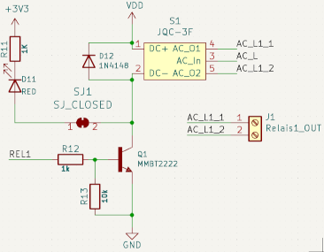

# ESP8266 based controller for smart home applications
## Introduction
The target is to setup a versatile smart home system. Home Assistant (www.home-assistant.io) running on a Raspberry Pi is used as open-source platform to integrate various devices from multiple brands. Especially to control lights and covers a system should comply with four requirements: 
- can be directly connected to the wall switches (limited size)
- is not linked to a specific supplier (open source)
- has direct connection to the host controller without the need of a bridge (Wifi)
- has low cost

As a solution a system based on an ESP8266 chip operated with Tasmota (tasmota.github.io) seems suitable. 

## Implementation
The schematic and layout of the PCB was implemented with the free version of KiCAD. The key elements are inspired by proven designs and combined in a minimalistic way on the PCB.

### Power supply
For the power supply, two step-down converters are used. The first one to convert from 230VAC to 5VDC. This is mainly used to operate the relays. The second conversion is by a simple LDO from 5VDC to 3.3VDC to operate the ESP8266.

### ESP8266 contoller
As controller an ESP8266 module was used to operate up to two relays, enable two external switches as input and a I2C communication to external devices.

For the operation and programming of the ESP8266 certain pins need to be pulled high. Two miniaturized switches are included to reset the device or get into programming mode.

### Relays
Two relay channels are implemented to allow an operation of one cover or two lights with the system. As option, an LED can be activated to indicate the state of the relay.

### Layout
The layout is defined by the used wall switch program. Two screw holes need to be considered, front size has a reduced size and limited height.

To reduce the risk, high voltage line are placed on the backside, covered by components. Low voltage and signal lines are placed as much as possible of the frontside. 

### ESP8266 contoller
As controller an ESP8266 module was used to operate up to two relays, enable two external switches as input and a I2C communication to external devices.

For the operation and programming of the ESP8266 certain pins need to be pulled high. Two miniaturized switches are included to reset the device or get into programming mode.

### Relays
Two relay channels are implemented to allow an operation of one cover or two lights with the system. As option, an LED can be activated to indicate the state of the relay.

### Layout
The layout is defined by the used wall switch program. Two screw holes need to be considered, front size has a reduced size and limited height.
To reduce the risk, high voltage line are placed on the backside, covered by components. Low voltage and signal lines are placed as much as possible of the frontside. 

### Firmware
To operate the ESP system, the open-source firmware Tasmota is used. For the majority of the controllers the standard firmware is suitable. Although some cases need a dedicated version to enable operation of RGB LED stripes, read specific I2C sensors or read the power & water meters.

### Preparation
The bare PCB is produced by a Chinese manufacturer. Assembly is done manually, first the SMD components and the ESP8266 module. Then a system check and programming is performed. Finally, the through hole components are soldered.

## Summary
Currently 24 of theses IoT controller are installed and running as
- Cover switches
- Light switches (bulbs and RGB LEDs)
- 3D printer controller
- Power & water metering
- Valve controller for gardening
- Environmental sensors
  
The overall failure rate of the system is low and not except for one ESP8266 module breakdown not linked to the design. The cost of one module is about 10€. To conclude, the initial targets are fulfilled, and the system is constantly extended.

### Next steps
As an improved version the transition to ESP32 would be helpful to increase the number of available GPIOs. Another limitation is that the relays can only handle 7A max current, which might be critical for some use-cases
